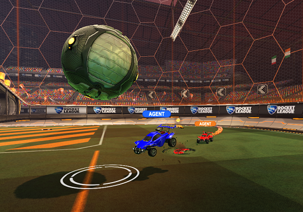

# BakkesRocketSimPlayer
A BakkesMod plugin for viewing RocketSim games in Rocket League

## Building
Build the .vcxproj with Visual Studio or MSBuild. 
CMake support may happen in the future, but since BakkesMod plugins are Windows only, I don't see a good reason to.

## Usage in Rocket League
 - Place the built plugin DLL in your bakkesmod plugins folder, then enable it from BakkesMod plugin manager in-game.
 - Follow the instructions in the `BakkesRocketSimPlayer` plugin tab.

## Usage From rlgym_sim
Simply copy `rocketsimplayer_rlgym_sim_client.py` into your project and call `send_data(gamestate, actions)` each step.

Actions of each agent are required so that the cars in RL will follow along correctly.